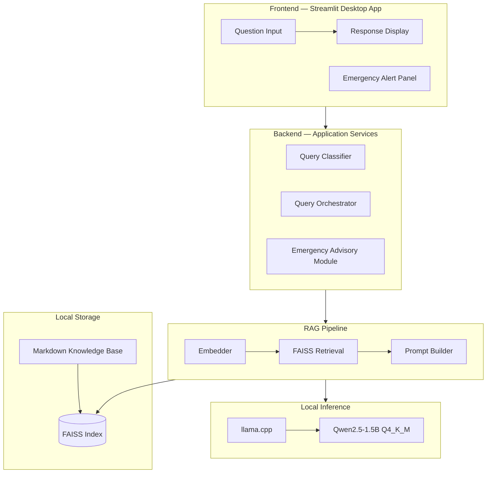

# PoultryGuard AI

Offline AI-powered poultry health, vaccination, climate, biosecurity, and farm management assistant for the Africa Deep Tech Challenge (ADTC) 2026.

PoultryGuard AI runs entirely on the ADTC Standard Laptop without cloud APIs, internet access, or dedicated GPU hardware. It combines a curated Markdown knowledge base, a local FAISS vector store, and a quantised GGUF language model to deliver accurate, grounded advisory responses to poultry farmers across Africa.

> **Status:** Sprint 1.5 complete — architecture refined with Query Classification Layer and Emergency Advisory Module; knowledge base schema and validator implemented. Application implementation begins in Sprint 2.

---

## Project Overview

PoultryGuard AI supports poultry farmers, extension officers, students, and farm managers with local-first guidance across:

- Poultry disease awareness and early symptom triage
- Vaccination schedule assistance
- Farm climate and housing recommendations
- Biosecurity checklists
- Feeding and flock management guidance
- Market and operational record support

---

## Architecture

PoultryGuard AI follows a clean layered architecture with strict offline-first constraints.



**Key boundaries:**

| Layer | Path | Responsibility |
|---|---|---|
| Frontend | `app/frontend/` | Streamlit pages and UI components |
| Backend | `app/backend/` | Query orchestration, entry point, and Query Classifier |
| Services | `app/services/` | Use-case services and emergency advisory |
| RAG | `rag/` | Chunking, embedding, retrieval, prompt building |
| Inference | `models/` | llama.cpp integration and model configuration |
| Knowledge Base | `knowledge_base/` | Curated Markdown domain documents |
| Vector Store | `vector_store/` | Generated FAISS index (git-ignored) |
| Config | `app/config/` | Pydantic settings and defaults |
| Utils | `app/utils/` | Logging, timing, and memory monitoring |

Full architecture documentation: [`docs/architecture/`](docs/architecture/)

---

## Technology Stack

| Component | Technology |
|---|---|
| Language | Python 3.11 |
| Local inference | llama.cpp via `llama-cpp-python` |
| Model | Qwen2.5-1.5B-Instruct Q4_K_M GGUF |
| Embeddings | `sentence-transformers/all-MiniLM-L6-v2` |
| Vector store | FAISS (`faiss-cpu`) |
| Knowledge base | Markdown files |
| Desktop UI | Streamlit |
| Testing | pytest |
| Linting and formatting | Ruff |
| CI | GitHub Actions (ubuntu-22.04) |
| Containerisation | Docker Compose |

---

## ADTC Hardware Target

| Specification | Value |
|---|---|
| CPU | Intel Core i5 10th–12th Gen or AMD Ryzen 5 |
| RAM | 8 GB |
| GPU | None (CPU-only inference) |
| OS | Ubuntu 22.04 LTS |
| Network | Not required at runtime |
| Model RAM usage | ~1.5 GB (Q4_K_M) |
| Total RAM budget | < 6 GB peak |

---

## Quick Start

> Application code is not yet implemented. These commands will work after Sprint 5.

```bash
git clone https://github.com/your-org/poultryguard-ai.git
cd poultryguard-ai
python3.11 -m venv .venv
source .venv/bin/activate
pip install -r requirements-dev.txt
python scripts/download_model.py
python scripts/build_index.py
streamlit run app/backend/main.py
```

For offline deployment, see [`docs/architecture/deployment.md`](docs/architecture/deployment.md).

---

## Repository Structure

```text
poultryguard-ai/
├── app/                    # Frontend, backend, services, config, utils
│   ├── backend/            # Entry point and query orchestrator
│   ├── frontend/           # Streamlit pages and components
│   ├── services/           # Use-case services and emergency advisory
│   ├── config/             # Pydantic settings and defaults
│   └── utils/              # Logging, timing, memory monitoring
├── rag/                    # Chunking, embeddings, indexing, retrieval, prompts
├── models/                 # llama.cpp inference boundary and model configs
├── knowledge_base/         # Curated Markdown knowledge base (7 domains)
├── vector_store/           # Generated FAISS index (git-ignored)
├── datasets/               # Raw, processed, and synthetic evaluation datasets
├── evaluation/             # Answer quality evaluation scripts and results
├── benchmarks/             # Performance benchmark scripts and results
├── profiler/               # Runtime profiling helpers
├── scripts/                # Developer utility scripts
├── notebooks/              # Research notebooks
├── tests/                  # pytest test suite (unit, integration, smoke)
├── docs/                   # Architecture, API, deployment, and benchmark docs
│   ├── architecture/       # System design documents (Sprint 1)
│   └── project_plan.md     # Sprint roadmap
├── report/                 # ADTC submission report and writeups
├── demo/                   # Demo scripts and walkthrough
└── assets/                 # Branding and static assets
```

---

## Documentation

| Document | Description |
|---|---|
| [docs/knowledge_base_schema.md](docs/knowledge_base_schema.md) | Knowledge base document schema and validator reference |
| [docs/architecture/system_overview.md](docs/architecture/system_overview.md) | System overview and component map |
| [docs/architecture/software_architecture.md](docs/architecture/software_architecture.md) | Layered architecture and module map |
| [docs/architecture/data_flow.md](docs/architecture/data_flow.md) | Data flow through indexing and query pipelines |
| [docs/architecture/model_selection.md](docs/architecture/model_selection.md) | LLM and embedding model selection |
| [docs/architecture/rag_design.md](docs/architecture/rag_design.md) | RAG pipeline design |
| [docs/architecture/deployment.md](docs/architecture/deployment.md) | Deployment guide |
| [docs/architecture/adtc_alignment.md](docs/architecture/adtc_alignment.md) | ADTC 2026 compliance |
| [docs/project_plan.md](docs/project_plan.md) | Sprint roadmap |
| [ROADMAP.md](ROADMAP.md) | High-level phase overview |
| [CONTRIBUTING.md](CONTRIBUTING.md) | Contribution guidelines |

---

## Development

```bash
make lint        # ruff check .
make format      # ruff format .
make test        # pytest
make index       # build FAISS index from knowledge base
make run         # streamlit run app/backend/main.py
make benchmark   # run performance benchmarks
```

---

## Roadmap

See [`docs/project_plan.md`](docs/project_plan.md) for the full sprint plan and [`ROADMAP.md`](ROADMAP.md) for the high-level phase overview.

Current sprint: **Sprint 1.5 — Architecture Refinement** ✅

Next sprint: **Sprint 2 — Knowledge Base**

---

## ADTC Compliance

PoultryGuard AI is designed for the ADTC Standard Laptop:

- CPU-only inference (`n_gpu_layers=0`)
- 8 GB RAM compatible (peak usage < 6 GB)
- Fully offline at runtime (zero network calls)
- Ubuntu 22.04 LTS and Windows 10/11 compatible
- Open-source MIT licence

Full compliance mapping: [`docs/architecture/adtc_alignment.md`](docs/architecture/adtc_alignment.md)

---

## Licence

This project is released under the MIT Licence. See [LICENSE](LICENSE) for details.
