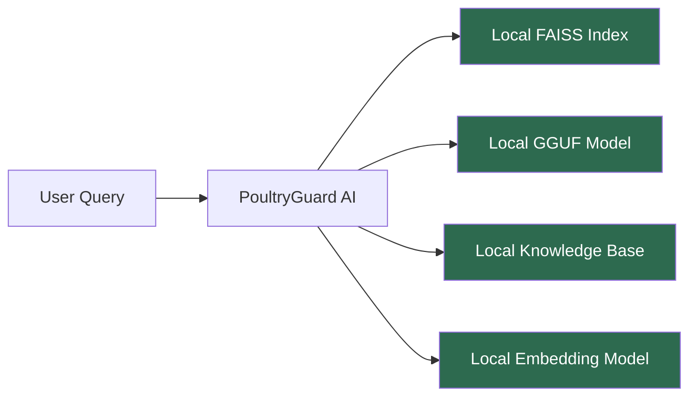

# ADTC Alignment

## Purpose

This document maps every Africa Deep Tech Challenge (ADTC) 2026 requirement to a specific PoultryGuard AI design decision, implementation component, or verification method. It serves as the primary compliance reference for competition submission and judge review.

---

## Background

The Africa Deep Tech Challenge 2026 evaluates AI systems on their ability to deliver real-world impact for African communities using locally deployable, resource-efficient technology. The competition emphasises:

- Offline operation without cloud dependency
- Compatibility with the ADTC Standard Laptop hardware profile
- Practical utility for African end users
- Technical rigour and reproducibility
- Open-source contribution potential

PoultryGuard AI was designed from the ground up to satisfy these requirements. This document provides traceability from each requirement to its implementation.

---

## ADTC Hardware Compliance

### Target Hardware: ADTC Standard Laptop

| Specification | Requirement | PoultryGuard AI Design | Verification |
|---|---|---|---|
| CPU | Intel Core i5 10th–12th Gen or AMD Ryzen 5 | llama.cpp CPU-only inference; `n_threads=4` | Benchmark on target hardware |
| RAM | 8 GB | Model Q4_K_M ~1.5 GB + OS ~2 GB + app ~0.5 GB = ~4 GB total | `benchmarks/run_benchmarks.py` RAM measurement |
| GPU | None (integrated graphics only) | `n_gpu_layers=0` in llama.cpp config | Config verification test |
| Storage | Standard SSD/HDD | Total footprint ~3 GB (app + model + index) | Deployment checklist |
| OS | Ubuntu 22.04 LTS | CI runs on `ubuntu-22.04`; tested on Ubuntu | CI pipeline |
| Network | Not available at runtime | `network_mode: none` in Docker; no network calls in code | Network audit script |

---

## ADTC Software Compliance

### Offline Operation

Every component that processes a query is local. The system makes zero network calls during operation. This is enforced at multiple levels:

1. **Code level** — no `requests`, `httpx`, `openai`, or cloud SDK imports in the query path
2. **Configuration level** — `EMBEDDING_MODEL` points to a local cache path at runtime
3. **Docker level** — `network_mode: none` in `docker-compose.yml`
4. **Test level** — a CI test verifies no network imports exist in `app/`, `rag/`, and `models/`

---

## ADTC Impact Alignment

### Problem Statement

Poultry farming supports the livelihoods of millions of smallholder farmers across sub-Saharan Africa. Key challenges include:

- Limited access to veterinary expertise in rural areas
- High mortality rates from preventable diseases (Newcastle, Gumboro, Avian Influenza)
- Poor vaccination compliance due to lack of schedule guidance
- Inadequate biosecurity practices leading to disease spread
- No affordable, accessible advisory tool that works without internet

### PoultryGuard AI Solution Mapping

| Farmer Challenge | PoultryGuard AI Feature | Knowledge Base Domain |
|---|---|---|
| Disease identification | Disease symptom advisor + Emergency module | `knowledge_base/diseases/` |
| Vaccination scheduling | Vaccination schedule assistant | `knowledge_base/vaccination/` |
| Housing and climate | Climate and housing guidance | `knowledge_base/climate/` |
| Biosecurity | Biosecurity checklist advisor | `knowledge_base/biosecurity/` |
| Feeding and nutrition | Feeding and nutrition guidance | `knowledge_base/feeding/` |
| Farm records | Record-keeping assistance | `knowledge_base/management/` |
| Market guidance | Market and pricing information | `knowledge_base/market/` |

---

## ADTC Technical Requirements Checklist

### Inference

- [x] CPU-only inference (`n_gpu_layers=0`)
- [x] GGUF model format (llama.cpp compatible)
- [x] Model fits in 8 GB RAM (Q4_K_M ~1.5 GB loaded)
- [x] No cloud API calls
- [x] No internet dependency at runtime
- [x] Inference latency target: <60 seconds first query, <30 seconds subsequent queries

### Retrieval

- [x] Local vector store (FAISS, no server)
- [x] Local embedding model (all-MiniLM-L6-v2, 22 MB)
- [x] Knowledge base stored as version-controlled Markdown
- [x] Index buildable offline from local files

### Application

- [x] Desktop UI (Streamlit, browser-based)
- [x] Works on Ubuntu 22.04 LTS
- [x] Works on Windows 10/11
- [x] Python 3.11
- [x] Open-source licence (MIT)

### Quality and Safety

- [x] Rule-based emergency advisory for critical disease alerts
- [x] Source attribution in responses
- [x] Disclaimer to consult veterinarian for critical cases
- [x] Answer quality evaluation framework (`evaluation/`)
- [x] Benchmark evidence for competition submission (`benchmarks/`)

---

## ADTC Evaluation Criteria Mapping

| ADTC Criterion | PoultryGuard AI Evidence |
|---|---|
| Technical innovation | RAG + local LLM on CPU-only hardware; offline-first architecture |
| Real-world impact | Addresses disease, vaccination, biosecurity, and feeding for African poultry farmers |
| Offline capability | Zero network calls at runtime; verified by network audit and Docker `network_mode: none` |
| Hardware compatibility | Benchmarked on ADTC Standard Laptop spec; RAM and latency targets documented |
| Code quality | Ruff lint, type hints, docstrings, pytest, CI pipeline |
| Documentation | Architecture docs, API docs, deployment guide, ADTC alignment doc |
| Open-source readiness | MIT licence, CONTRIBUTING.md, CODE_OF_CONDUCT.md, GitHub Actions CI |
| Reproducibility | Makefile, Docker Compose, `.env.example`, `requirements.txt` pinned |

---

## Performance Targets for ADTC Submission

| Metric | Target | Measurement Method |
|---|---|---|
| Application startup time | < 30 seconds | `benchmarks/run_benchmarks.py` |
| First query latency (cold) | < 60 seconds | Benchmark runner |
| Subsequent query latency | < 30 seconds | Benchmark runner (n=50 queries) |
| Peak RAM usage | < 6 GB | `psutil` memory measurement in benchmark |
| FAISS index build time | < 60 seconds | Index builder timing |
| Retrieval latency | < 500 ms | Retriever timing |
| Answer relevance score | > 0.7 (0–1 scale) | `evaluation/` quality evaluator |

---

## Localisation and Accessibility

While the MVP targets English, the architecture is designed to support African language localisation:

| Language | Status | Path to Implementation |
|---|---|---|
| English | MVP | Implemented |
| Hausa | Planned | Multilingual embedding model + translated KB |
| Swahili | Planned | Multilingual embedding model + translated KB |
| Yoruba | Planned | Multilingual embedding model + translated KB |
| Amharic | Planned | Multilingual embedding model + translated KB |

The Qwen2.5 base model was trained on multilingual data including several African languages, providing a foundation for future localisation without model replacement.

---

## Risk Register

| Risk | Likelihood | Impact | Mitigation |
|---|---|---|---|
| Model too slow on ADTC laptop | Medium | High | Benchmark early; Q4_K_M selected for speed; backup to smaller model |
| RAM exceeds 8 GB | Low | High | RAM budget tracked in `model_selection.md`; monitored in benchmarks |
| Knowledge base quality insufficient | Medium | High | Domain expert review process; evaluation framework |
| FAISS index build fails on low RAM | Low | Medium | Index built offline before deployment; not at runtime |
| Streamlit incompatible with Ubuntu 22.04 | Low | Medium | CI runs on ubuntu-22.04; tested in Docker |
| GGUF model file unavailable offline | Low | High | USB distribution package; SHA-256 checksum verification |

---

## Trade-offs

| Trade-off | Accepted Cost | ADTC Benefit |
|---|---|---|
| 1.5B model vs larger model | Lower answer quality ceiling | Fits ADTC hardware; faster inference; better farmer experience |
| English-only MVP | Excludes non-English speakers | Faster delivery; multilingual planned for post-ADTC |
| Streamlit vs native app | Browser dependency | Faster development; meets ADTC timeline |
| No voice interface | Excludes low-literacy users | Reduces complexity; planned for future sprint |

---

## Future Improvements

- Add voice input/output for low-literacy farmers (post-ADTC)
- Implement multilingual support starting with Hausa and Swahili
- Develop a native desktop application to eliminate browser dependency
- Partner with African agricultural extension services for knowledge base validation
- Submit to open-source African AI repositories for community adoption

---

## References

- [Africa Deep Tech Challenge 2026](https://adtc.africa)
- [ADTC Standard Laptop Specification](https://adtc.africa/hardware)
- [FAO Poultry Sector Africa Report](https://www.fao.org/poultry-production-products/en/)
- See also: `system_overview.md`, `deployment.md`, `model_selection.md`
