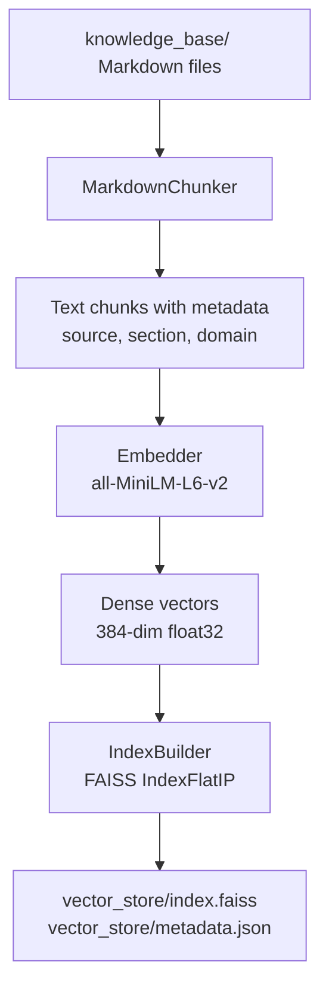
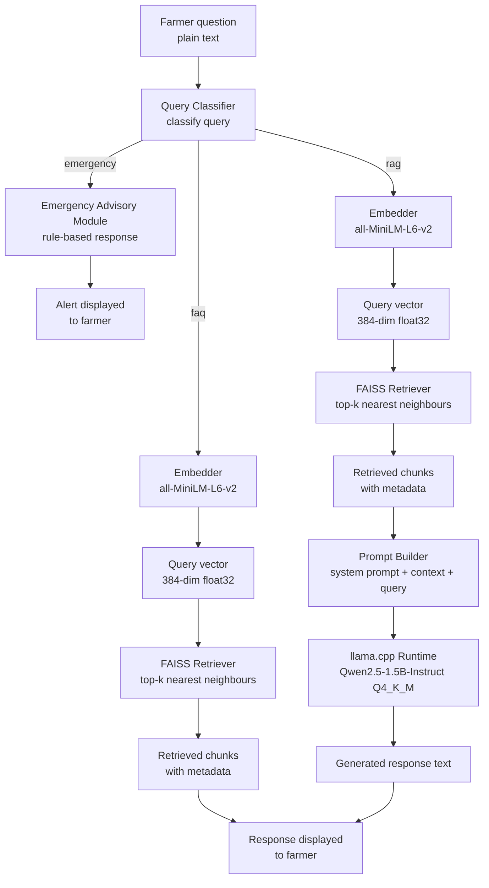
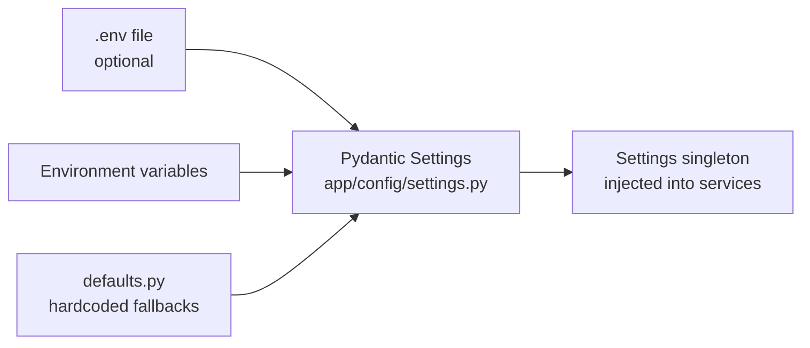
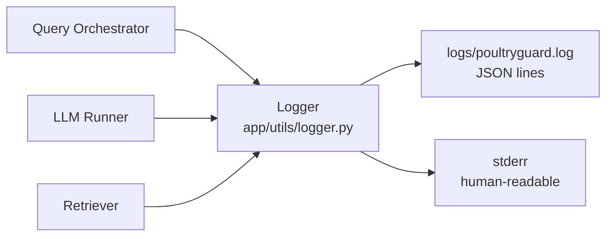
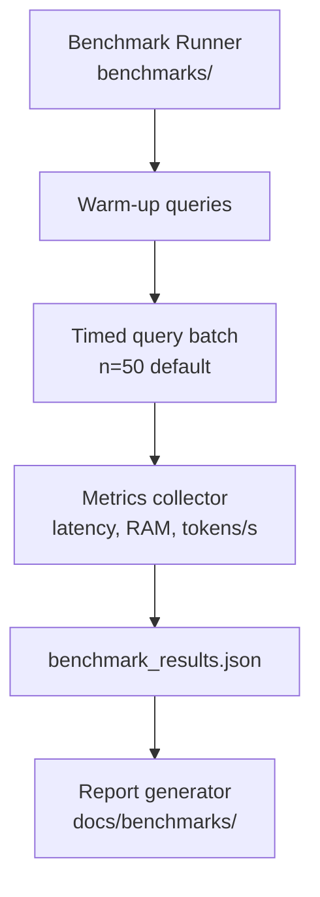

# Data Flow

## Purpose

This document describes how data moves through PoultryGuard AI from the moment a farmer submits a question to the moment a response is displayed. It covers the two primary flows — the indexing pipeline and the query pipeline — as well as supporting flows for configuration loading, logging, and benchmarking.

---

## Background

PoultryGuard AI operates two distinct data pipelines:

1. **Indexing pipeline** — a one-time (or on-demand) offline process that transforms raw Markdown knowledge base documents into a searchable FAISS vector index.
2. **Query pipeline** — the real-time path triggered by every farmer question, combining retrieval from the FAISS index with local LLM inference to produce a grounded response.

Both pipelines are entirely local. No data leaves the device at any point.

---

## Design Decisions

| Decision | Rationale |
|---|---|
| Separate indexing and query pipelines | Indexing is expensive; it runs once and persists. Query pipeline is lightweight and fast. |
| Chunked Markdown documents | Retrieval precision improves when documents are split into semantically coherent chunks rather than retrieved whole. |
| Embedding reuse between indexing and query | The same embedding model is used for both document chunks and query vectors to ensure cosine similarity is meaningful. |
| Context window budget management | Retrieved chunks are trimmed to fit within the LLM context window alongside the system prompt and query. |
| Emergency check before RAG | Avoids latency of retrieval and inference for critical alerts that need immediate deterministic response. |
| Query Classification Layer before all routing | Centralises routing logic; the orchestrator delegates the routing decision rather than containing conditional logic itself. |

---

## Flow 1 — Indexing Pipeline

This pipeline runs during initial setup and whenever the knowledge base is updated.



### Indexing Steps

| Step | Module | Input | Output |
|---|---|---|---|
| 1. Discover documents | `rag/indexing/index_builder.py` | `knowledge_base/` directory | List of `.md` file paths |
| 2. Parse and chunk | `rag/chunking/markdown_chunker.py` | Markdown file content | List of `Chunk(text, source, section, domain)` |
| 3. Embed chunks | `rag/embeddings/embedder.py` | List of chunk texts | NumPy array of shape `(n_chunks, 384)` |
| 4. Build FAISS index | `rag/indexing/index_builder.py` | Embedding matrix | `faiss.IndexFlatIP` object |
| 5. Persist index | `rag/indexing/index_builder.py` | FAISS index + chunk metadata | `vector_store/index.faiss`, `vector_store/metadata.json` |

### Chunk Metadata Schema

Each chunk stored in `metadata.json` carries:

```json
{
  "id": 0,
  "text": "Newcastle disease is caused by...",
  "source": "knowledge_base/diseases/newcastle_disease.md",
  "section": "Symptoms",
  "domain": "diseases",
  "char_count": 412
}
```

---

## Flow 2 — Query Pipeline

This pipeline executes on every farmer query at runtime.



### Query Pipeline Steps

| Step | Module | Input | Output |
|---|---|---|---|
| 1. Classify query | `app/backend/classifier.py` | Query text | `QueryClass` enum: `emergency`, `faq`, or `rag` |
| 2. Emergency response | `app/services/emergency_service.py` | Query text (emergency path only) | `EmergencyResult(triggered, severity, message)` |
| 3. Embed query | `rag/embeddings/embedder.py` | Query text | NumPy vector `(1, 384)` |
| 4. Retrieve chunks | `rag/retrieval/retriever.py` | Query vector, `top_k` | List of `Chunk` objects ranked by similarity |
| 5. Build prompt | `rag/prompts/prompt_builder.py` | Query text, chunks, system prompt template | Formatted prompt string (RAG path only) |
| 6. Run inference | `models/inference/llm_runner.py` | Prompt string, generation config | Response text (RAG path only) |
| 7. Return response | `app/services/query_service.py` | Response text | `QueryResult(response, sources, latency_ms)` |

---

## Prompt Structure

The prompt assembled by `PromptBuilder` follows the Qwen2.5-Instruct chat template:

```
<|im_start|>system
You are PoultryGuard AI, an offline assistant for poultry farmers in Africa.
Answer only based on the provided context. If the context does not contain
enough information, say so clearly. Do not invent facts.

Context:
[CHUNK 1 — source: diseases/newcastle_disease.md, section: Symptoms]
Newcastle disease presents with...

[CHUNK 2 — source: vaccination/newcastle_schedule.md, section: Schedule]
Vaccinate at day 7 using...

[CHUNK 3 — ...]
...
<|im_end|>
<|im_start|>user
My chickens have twisted necks and are dying. What should I do?
<|im_end|>
<|im_start|>assistant
```

Context budget management ensures the total prompt never exceeds `N_CTX - MAX_TOKENS` tokens.

---

## Flow 3 — Configuration Loading



Configuration is loaded once at startup. All services receive a `Settings` instance via constructor injection.

---

## Flow 4 — Logging



Every query produces a single structured log entry capturing all latency and memory metrics.

---

## Flow 5 — Benchmarking



Benchmarking runs as a separate script, not during normal operation. It exercises the full query pipeline and records hardware performance metrics for ADTC submission evidence.

---

## Data at Rest

| Artefact | Location | Format | Git-tracked |
|---|---|---|---|
| Knowledge base documents | `knowledge_base/` | Markdown | Yes |
| FAISS index | `vector_store/index.faiss` | Binary | No |
| Chunk metadata | `vector_store/metadata.json` | JSON | No |
| GGUF model file | `models/gguf/` | GGUF binary | No |
| Embedding model cache | `~/.cache/huggingface/` | Binary | No |
| Query logs | `logs/` | JSON lines | No |
| Benchmark results | `benchmarks/results/` | JSON | Optional |

---

## Trade-offs

| Trade-off | Accepted Cost | Benefit |
|---|---|---|
| Full index rebuild on KB update | Rebuild time (~seconds for small KB) | Simplicity; no incremental update logic required |
| Metadata stored as flat JSON | Linear scan for metadata lookup | No database dependency; fast enough for <10 000 chunks |
| Synchronous query pipeline | UI blocks during inference | Eliminates async complexity in MVP; acceptable for single-user desktop app |
| No query caching | Repeated identical queries re-run inference | Avoids stale cache issues; inference is fast enough on this model size |

---

## Future Improvements

- Add incremental index updates to avoid full rebuilds when only a few KB documents change
- Introduce a query result cache (LRU, in-memory) for repeated identical queries
- Add streaming token output from llama.cpp to improve perceived UI responsiveness
- Persist conversation history to SQLite for session continuity across restarts

---

## References

- [FAISS IndexFlatIP documentation](https://faiss.ai/cpp_api/struct/structfaiss_1_1IndexFlatIP.html)
- [Qwen2.5 chat template](https://huggingface.co/Qwen/Qwen2.5-1.5B-Instruct)
- [sentence-transformers all-MiniLM-L6-v2](https://huggingface.co/sentence-transformers/all-MiniLM-L6-v2)
- See also: `system_overview.md`, `rag_design.md`, `software_architecture.md`
