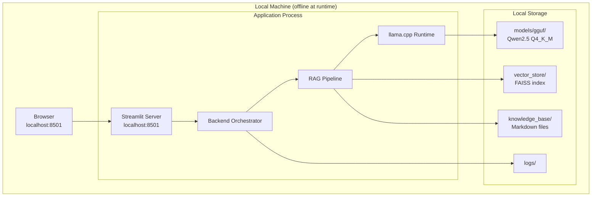
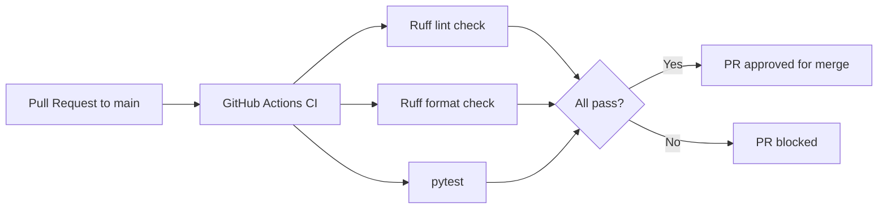

# Deployment

## Purpose

This document describes how PoultryGuard AI is deployed, configured, and distributed for each target environment. It covers local developer setup, Docker-based deployment, ADTC competition deployment, and offline distribution to end users. It is the authoritative reference for anyone packaging, distributing, or running the system.

---

## Background

PoultryGuard AI has three distinct deployment contexts:

1. **Developer environment** — engineers running the system locally for development and testing.
2. **ADTC competition environment** — the ADTC Standard Laptop running Ubuntu 22.04 LTS, evaluated by competition judges.
3. **End-user offline deployment** — smallholder farmers or extension officers running the system on a laptop without internet access.

All three contexts share the same core constraint: the system must run entirely offline after initial setup.

---

## Design Decisions

| Decision | Rationale |
|---|---|
| No cloud services at runtime | Core ADTC requirement; rural deployment constraint |
| Docker Compose for reproducible dev environment | Eliminates "works on my machine" issues; consistent CI and local parity |
| Makefile as developer task runner | Single entry point for common tasks; works on Ubuntu and Windows (via WSL or Git Bash) |
| GGUF model excluded from Git | Binary files are too large for Git; distributed separately via USB or one-time download |
| `.env` file for local configuration | Keeps secrets and paths out of source code; `.env.example` documents all variables |
| Virtual environment isolation | Prevents dependency conflicts with system Python |

---

## System Requirements

### Minimum (ADTC Standard Laptop)

| Component | Requirement |
|---|---|
| CPU | Intel Core i5 10th–12th Gen or AMD Ryzen 5 |
| RAM | 8 GB |
| Storage | 5 GB free (OS + app + model + index) |
| GPU | Not required (CPU-only inference) |
| OS | Ubuntu 22.04 LTS |
| Python | 3.11 |
| Internet | Not required at runtime |

### Recommended (Developer)

| Component | Requirement |
|---|---|
| CPU | Any modern x86-64 with 4+ cores |
| RAM | 16 GB |
| Storage | 10 GB free |
| OS | Ubuntu 22.04 LTS or Windows 10/11 |
| Python | 3.11 |
| Internet | Required for initial setup only |

---

## Deployment Architecture



---

## Environment Setup

### 1. Clone the Repository

```bash
git clone https://github.com/your-org/poultryguard-ai.git
cd poultryguard-ai
```

### 2. Create Python Virtual Environment

```bash
python3.11 -m venv .venv
source .venv/bin/activate          # Ubuntu / macOS
# .venv\Scripts\activate           # Windows
```

### 3. Install Dependencies

```bash
pip install --upgrade pip
pip install -r requirements-dev.txt
```

### 4. Configure Environment

```bash
cp .env.example .env
# Edit .env to set MODEL_PATH and other parameters
```

### 5. Download GGUF Model

```bash
# With internet access (developer setup):
python scripts/download_model.py

# Without internet (offline deployment):
# Copy qwen2.5-1.5b-instruct-q4_k_m.gguf to models/gguf/
```

### 6. Build the Vector Index

```bash
python scripts/build_index.py
```

### 7. Run the Application

```bash
streamlit run app/backend/main.py
# Open browser at http://localhost:8501
```

### 8. Verify Installation

```bash
make test
```

---

## Makefile Targets

| Target | Command | Description |
|---|---|---|
| `make install` | `pip install -r requirements-dev.txt` | Install all dependencies |
| `make lint` | `ruff check .` | Run Ruff linter |
| `make format` | `ruff format .` | Format code with Ruff |
| `make test` | `pytest` | Run full test suite |
| `make index` | `python scripts/build_index.py` | Build FAISS index from knowledge base |
| `make run` | `streamlit run app/backend/main.py` | Start the application |
| `make benchmark` | `python benchmarks/run_benchmarks.py` | Run performance benchmarks |
| `make clean` | Remove `__pycache__`, `.pytest_cache`, `logs/` | Clean build artefacts |
| `make docker-up` | `docker compose up` | Start Docker development environment |
| `make docker-down` | `docker compose down` | Stop Docker environment |

---

## Docker Deployment

The `docker-compose.yml` provides a reproducible development and testing environment.

```yaml
# docker-compose.yml (design — implemented in Sprint 6)
services:
  poultryguard:
    build: .
    volumes:
      - ./models/gguf:/app/models/gguf:ro
      - ./vector_store:/app/vector_store
      - ./logs:/app/logs
    ports:
      - "8501:8501"
    environment:
      - MODEL_PATH=/app/models/gguf/qwen2.5-1.5b-instruct-q4_k_m.gguf
      - FAISS_INDEX_PATH=/app/vector_store/index.faiss
    network_mode: none    # Enforce offline operation
```

The `network_mode: none` directive enforces the offline constraint at the container level.

---

## ADTC Competition Deployment

The ADTC competition deployment follows a specific checklist to ensure the system runs correctly on the ADTC Standard Laptop under evaluation conditions.

### Pre-competition Checklist

- [ ] GGUF model file present at `models/gguf/`
- [ ] FAISS index built and present at `vector_store/`
- [ ] `.env` configured with correct paths
- [ ] `make test` passes with zero failures
- [ ] `make benchmark` completes and produces results
- [ ] Application starts in under 30 seconds
- [ ] First query responds in under 60 seconds
- [ ] No network calls made during operation (verified with `nethogs` or `ss`)
- [ ] RAM usage stays below 6 GB during operation
- [ ] All knowledge base domains return relevant results

### Competition Startup Sequence

```bash
cd poultryguard-ai
source .venv/bin/activate
streamlit run app/backend/main.py --server.headless true
```

---

## Offline Distribution Package

For end-user deployment without internet access, the distribution package contains:

```
poultryguard-ai-offline/
├── poultryguard-ai/          # Full repository
├── models/
│   └── qwen2.5-1.5b-instruct-q4_k_m.gguf
├── python-3.11-packages/     # Offline pip wheel cache
├── install.sh                # One-command setup script
└── README-OFFLINE.md         # Plain-language setup instructions
```

The `install.sh` script:
1. Creates a virtual environment
2. Installs packages from the local wheel cache (no internet)
3. Copies the GGUF model to `models/gguf/`
4. Builds the FAISS index
5. Creates a desktop launcher shortcut

---

## Environment Variables Reference

All variables are documented in `.env.example`:

| Variable | Default | Description |
|---|---|---|
| `MODEL_PATH` | `models/gguf/qwen2.5-1.5b-instruct-q4_k_m.gguf` | Path to GGUF model file |
| `EMBEDDING_MODEL` | `sentence-transformers/all-MiniLM-L6-v2` | Embedding model name or local path |
| `FAISS_INDEX_PATH` | `vector_store/index.faiss` | Path to FAISS index |
| `METADATA_PATH` | `vector_store/metadata.json` | Path to chunk metadata |
| `KNOWLEDGE_BASE_PATH` | `knowledge_base/` | Root of Markdown knowledge base |
| `CHUNK_SIZE` | `512` | Chunking token target |
| `CHUNK_OVERLAP` | `64` | Chunking overlap tokens |
| `TOP_K` | `5` | Retrieval top-k |
| `MAX_TOKENS` | `512` | LLM max output tokens |
| `TEMPERATURE` | `0.2` | LLM sampling temperature |
| `N_CTX` | `2048` | llama.cpp context window |
| `N_THREADS` | `4` | llama.cpp CPU threads |
| `LOG_LEVEL` | `INFO` | Logging level |
| `LOG_PATH` | `logs/poultryguard.log` | Log file path |

---

## CI/CD Pipeline



CI runs on `ubuntu-22.04` to match the ADTC target environment. No model files are downloaded during CI; tests use mocked inference.

---

## Trade-offs

| Trade-off | Accepted Cost | Benefit |
|---|---|---|
| Streamlit browser-based UI | Requires browser; not a native app | Fast development; Python-native; no Electron overhead |
| Virtual environment (not conda) | Manual Python version management | Lighter weight; standard Python tooling |
| No auto-update mechanism | Manual update process | Eliminates network dependency; appropriate for offline deployment |
| Docker optional (not required) | Developers must manage local Python | Avoids Docker requirement on resource-constrained ADTC laptop |

---

## Future Improvements

- Package as a standalone executable using PyInstaller or Nuitka for one-click installation
- Add a native desktop launcher (`.desktop` file on Ubuntu, `.exe` installer on Windows)
- Implement a self-contained offline update mechanism via USB package
- Add system health check endpoint for competition judges to verify deployment status

---

## References

- [Streamlit deployment](https://docs.streamlit.io/deploy)
- [llama-cpp-python installation](https://github.com/abetlen/llama-cpp-python#installation)
- [Docker Compose reference](https://docs.docker.com/compose/)
- See also: `system_overview.md`, `adtc_alignment.md`, `software_architecture.md`
