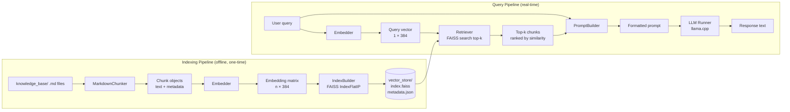

# RAG Pipeline Design

## Purpose

This document defines the complete design of the Retrieval-Augmented Generation (RAG) pipeline for PoultryGuard AI. It covers document ingestion, chunking strategy, embedding, vector indexing, retrieval, prompt construction, and the integration boundary with the local LLM. It is the authoritative reference for engineers implementing or modifying the `rag/` module.

---

## Background

Retrieval-Augmented Generation grounds LLM responses in a curated, domain-specific knowledge base rather than relying solely on the model's parametric memory. For PoultryGuard AI this is essential because:

1. The 1.5B parameter model has limited domain knowledge about African poultry farming practices.
2. Factual accuracy is critical — incorrect disease or vaccination advice could harm farmers' livelihoods.
3. The knowledge base can be updated independently of the model, allowing domain experts to improve content without retraining.
4. Retrieved source references allow farmers and extension officers to verify advice.

---

## Design Decisions

| Decision | Rationale |
|---|---|
| Markdown as knowledge base format | Human-readable, version-controllable, easy for domain experts to edit without programming knowledge |
| Fixed-size chunking with overlap | Simple, predictable, and effective for retrieval; overlap prevents context loss at chunk boundaries |
| `all-MiniLM-L6-v2` for embeddings | 22 MB, CPU-fast, adequate semantic quality; see `model_selection.md` |
| FAISS `IndexFlatIP` | Exact inner-product search; no approximation error; fast enough for <10 000 chunks on CPU |
| Top-5 retrieval | Balances context richness against prompt length and context window budget |
| Qwen2.5 chat template for prompts | Ensures the model receives input in the format it was instruction-tuned on |
| Source attribution in prompt | Allows the model to cite sources; improves farmer trust and verifiability |

---

## RAG Pipeline Architecture



---

## Module Specifications

### `rag/chunking/markdown_chunker.py`

**Responsibility:** Parse Markdown documents and split them into semantically coherent chunks suitable for embedding and retrieval.

**Algorithm:**

1. Parse the Markdown file using a heading-aware parser.
2. Split on heading boundaries (H1, H2, H3) to preserve semantic sections.
3. If a section exceeds `CHUNK_SIZE` tokens, apply sliding-window splitting with `CHUNK_OVERLAP` token overlap.
4. Attach metadata to each chunk: `source`, `section`, `domain`, `char_count`.

**Chunk dataclass:**

```python
@dataclass
class Chunk:
    id: int
    text: str
    source: str       # relative path to source .md file
    section: str      # heading under which this chunk appears
    domain: str       # knowledge base domain (diseases, vaccination, etc.)
    char_count: int
```

**Configuration:**

| Parameter | Default | Description |
|---|---|---|
| `CHUNK_SIZE` | 512 | Target token count per chunk |
| `CHUNK_OVERLAP` | 64 | Token overlap between adjacent chunks |

---

### `rag/embeddings/embedder.py`

**Responsibility:** Convert text strings to dense vector representations using a local sentence transformer model.

**Interface:**

```python
class Embedder:
    def __init__(self, model_name: str, cache_dir: Path) -> None: ...
    def embed(self, texts: list[str]) -> np.ndarray: ...
    def embed_query(self, text: str) -> np.ndarray: ...
```

**Implementation notes:**
- Uses `sentence-transformers` library with `all-MiniLM-L6-v2`.
- Model is loaded once at startup and reused for all queries.
- `embed()` processes batches for indexing efficiency.
- `embed_query()` processes a single string for query-time use.
- Output vectors are L2-normalised before storage to enable inner-product similarity as cosine similarity.

---

### `rag/indexing/index_builder.py`

**Responsibility:** Build, persist, and load the FAISS vector index from embedded chunks.

**Interface:**

```python
class IndexBuilder:
    def __init__(self, index_path: Path, metadata_path: Path) -> None: ...
    def build(self, chunks: list[Chunk], embeddings: np.ndarray) -> None: ...
    def load(self) -> tuple[faiss.Index, list[Chunk]]: ...
```

**FAISS index type:** `IndexFlatIP` (exact inner-product search on L2-normalised vectors = cosine similarity).

**Persistence:**
- `vector_store/index.faiss` — binary FAISS index
- `vector_store/metadata.json` — JSON array of chunk metadata

**Rebuild trigger:** Any change to `knowledge_base/` content should trigger a full index rebuild via `scripts/build_index.py`.

---

### `rag/retrieval/retriever.py`

**Responsibility:** Accept a query vector and return the top-k most similar chunks from the FAISS index.

**Interface:**

```python
class Retriever:
    def __init__(self, index: faiss.Index, chunks: list[Chunk], top_k: int) -> None: ...
    def retrieve(self, query_vector: np.ndarray) -> list[RetrievedChunk]: ...
```

**Output dataclass:**

```python
@dataclass
class RetrievedChunk:
    chunk: Chunk
    score: float      # cosine similarity score [0, 1]
    rank: int
```

**Filtering:** Chunks with similarity score below `MIN_SIMILARITY_THRESHOLD` (default: 0.3) are excluded from the prompt even if they are in the top-k. This prevents irrelevant context from degrading response quality.

---

### `rag/prompts/prompt_builder.py`

**Responsibility:** Assemble the final prompt string from the system prompt template, retrieved context chunks, and the user query.

**Interface:**

```python
class PromptBuilder:
    def __init__(self, system_prompt: str, max_context_tokens: int) -> None: ...
    def build(self, query: str, chunks: list[RetrievedChunk]) -> str: ...
```

**Prompt template structure:**

```
<|im_start|>system
{system_prompt}

Context:
{formatted_chunks}
<|im_end|>
<|im_start|>user
{query}
<|im_end|>
<|im_start|>assistant
```

**Context budget management:**
- Total prompt must not exceed `N_CTX - MAX_TOKENS` tokens.
- Chunks are added in rank order until the budget is exhausted.
- Each chunk is formatted as: `[Source: {domain}/{filename}, Section: {section}]\n{text}`

**System prompt (default):**

```
You are PoultryGuard AI, a trusted offline assistant for poultry farmers in Africa.
Your role is to provide accurate, practical guidance on poultry health, disease
prevention, vaccination, biosecurity, feeding, climate management, and farm records.

Answer only based on the provided context. If the context does not contain sufficient
information to answer the question, clearly state that you do not have enough
information rather than guessing. Do not invent facts, drug names, or dosages.

When describing disease symptoms or emergencies, always recommend consulting a
licensed veterinarian as the final authority.
```

---

## Knowledge Base Structure

The knowledge base is organised by domain under `knowledge_base/`. Each domain contains one or more Markdown files following a consistent schema.

```
knowledge_base/
├── diseases/
│   ├── newcastle_disease.md
│   ├── avian_influenza.md
│   ├── gumboro_disease.md
│   ├── marek_disease.md
│   ├── coccidiosis.md
│   └── ...
├── vaccination/
│   ├── vaccination_schedule_broilers.md
│   ├── vaccination_schedule_layers.md
│   └── ...
├── climate/
│   ├── housing_ventilation.md
│   ├── heat_stress_management.md
│   └── ...
├── biosecurity/
│   ├── farm_biosecurity_checklist.md
│   └── ...
├── feeding/
│   ├── broiler_nutrition.md
│   ├── layer_nutrition.md
│   └── ...
├── management/
│   ├── flock_records.md
│   └── ...
└── market/
    ├── market_pricing_guidance.md
    └── ...
```

**Markdown document schema:**

```markdown
---
title: Newcastle Disease
domain: diseases
tags: [newcastle, paramyxovirus, respiratory, neurological]
reviewed: false
sources: []
---

# Newcastle Disease

## Overview
...

## Symptoms
...

## Treatment and Management
...

## Prevention and Vaccination
...

## When to Call a Veterinarian
...
```

---

## Retrieval Quality Strategy

| Concern | Mitigation |
|---|---|
| Irrelevant chunks in top-k | Minimum similarity threshold filter (0.3) |
| Context window overflow | Token budget management in PromptBuilder |
| Duplicate content from overlapping chunks | Deduplication by source+section before prompt assembly |
| Poor retrieval for short queries | Query expansion not implemented in MVP; noted as future improvement |
| Domain mismatch | Domain metadata allows optional domain-scoped retrieval |

---

## Trade-offs

| Trade-off | Accepted Cost | Benefit |
|---|---|---|
| `IndexFlatIP` (exact search) | O(n) search time | No approximation error; simple; fast for <10 000 chunks |
| Fixed chunk size | May split mid-sentence | Predictable index size; simple implementation |
| No query expansion | Lower recall on short/ambiguous queries | Avoids added latency and complexity in MVP |
| No re-ranking | Retrieved order may not be optimal | Eliminates cross-encoder dependency (~100 MB extra model) |
| Single embedding model | English-optimised | Sufficient for MVP; multilingual model planned for later sprint |

---

## Future Improvements

- Add a cross-encoder re-ranker (e.g., `cross-encoder/ms-marco-MiniLM-L-6-v2`) to improve retrieval precision
- Implement query expansion using the LLM to generate alternative phrasings before retrieval
- Add domain-scoped retrieval to restrict search to relevant knowledge base sections
- Introduce incremental FAISS index updates using `IndexIDMap` to avoid full rebuilds
- Add multilingual embedding support for Hausa, Swahili, and Yoruba queries
- Implement hybrid retrieval combining BM25 keyword search with dense vector search

---

## References

- [FAISS documentation](https://faiss.ai)
- [sentence-transformers](https://www.sbert.net)
- [Qwen2.5 chat template](https://huggingface.co/Qwen/Qwen2.5-1.5B-Instruct)
- [RAG survey — Lewis et al. 2020](https://arxiv.org/abs/2005.11401)
- See also: `data_flow.md`, `model_selection.md`, `software_architecture.md`
