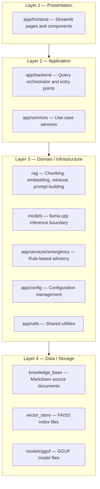
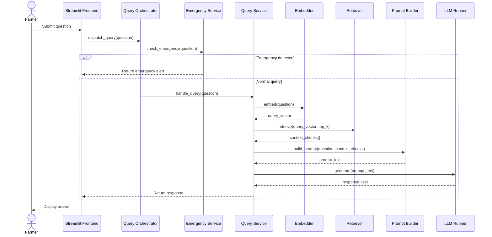

# Software Architecture

## Purpose

This document defines the internal software architecture of PoultryGuard AI. It describes the layered structure, module boundaries, dependency rules, and design patterns applied across the codebase. It is the authoritative reference for any engineer making structural decisions about where code belongs and how components communicate.

---

## Background

PoultryGuard AI follows a clean, layered architecture adapted for a single-process desktop application. Because the system runs offline on a single machine, there is no network boundary between layers. However, maintaining clear logical boundaries is essential for testability, maintainability, and the ability to swap implementations (e.g., replacing Streamlit with a different UI, or FAISS with a different vector store) without cascading changes.

The architecture is inspired by Clean Architecture and Hexagonal Architecture principles, simplified to match the scale and constraints of this project.

---

## Design Decisions

| Decision | Rationale |
|---|---|
| Layered architecture with strict dependency direction | Outer layers depend on inner layers; inner layers never import from outer layers. Keeps domain logic testable in isolation. |
| Service layer as orchestration boundary | Application services coordinate workflows without containing business logic themselves. |
| Dependency injection via constructor arguments | Avoids global state; makes unit testing straightforward without mocking frameworks. |
| Configuration isolated in `app/config` | All tuneable parameters (model path, chunk size, top-k, temperature) live in one place. |
| No ORM or database | Offline constraint and small data volume make a file-based approach (Markdown + FAISS) sufficient. |
| Emergency module as a pure function module | Deterministic rule evaluation must never depend on LLM state or retrieval availability. |

---

## Layer Definitions



**Dependency rule:** arrows point inward only. `app/frontend` may import from `app/backend` and `app/services`. `app/services` may import from `rag` and `models`. `rag` and `models` may import from `app/config` and `app/utils`. Nothing in layers 3 or 4 imports from layers 1 or 2.

---

## Module Map

```
poultryguard-ai/
├── app/
│   ├── backend/
│   │   ├── main.py               # Application entry point
│   │   └── orchestrator.py       # Query routing and pipeline coordination
│   ├── frontend/
│   │   ├── pages/                # Streamlit multi-page app pages
│   │   │   ├── home.py
│   │   │   ├── disease_advisor.py
│   │   │   ├── vaccination.py
│   │   │   ├── climate.py
│   │   │   ├── biosecurity.py
│   │   │   ├── feeding.py
│   │   │   └── records.py
│   │   └── components/           # Reusable UI widgets
│   │       ├── chat_widget.py
│   │       ├── alert_banner.py
│   │       └── sidebar.py
│   ├── services/
│   │   ├── query_service.py      # Orchestrates RAG + LLM for a single query
│   │   ├── emergency_service.py  # Wraps the rule-based emergency module
│   │   ├── session_service.py    # Manages conversation history
│   │   └── index_service.py      # Triggers knowledge base indexing
│   ├── config/
│   │   ├── settings.py           # Pydantic settings model
│   │   └── defaults.py           # Default configuration constants
│   └── utils/
│       ├── logger.py             # Structured logging setup
│       ├── timer.py              # Latency measurement helpers
│       └── memory.py             # RAM usage monitoring helpers
│
├── rag/
│   ├── chunking/
│   │   └── markdown_chunker.py   # Parse and chunk Markdown documents
│   ├── embeddings/
│   │   └── embedder.py           # Local embedding model wrapper
│   ├── indexing/
│   │   └── index_builder.py      # Build and persist FAISS index
│   ├── retrieval/
│   │   └── retriever.py          # FAISS nearest-neighbour retrieval
│   └── prompts/
│       └── prompt_builder.py     # Assemble final LLM prompt
│
├── models/
│   ├── inference/
│   │   └── llm_runner.py         # llama-cpp-python inference wrapper
│   └── configs/
│       └── model_profiles.py     # Per-model RAM and parameter profiles
│
├── knowledge_base/               # Markdown source documents (see data_flow.md)
├── vector_store/                 # Generated FAISS index (git-ignored)
├── datasets/                     # Raw, processed, synthetic datasets
├── evaluation/                   # Answer quality evaluation scripts
├── benchmarks/                   # Performance benchmark scripts
├── profiler/                     # Runtime profiling helpers
├── scripts/                      # Developer utility scripts
├── tests/                        # Pytest test suite
└── docs/                         # All documentation
```

---

## Component Interaction Diagram



---

## Emergency Advisory Module

The Emergency Advisory Module is a deterministic, rule-based component that operates independently of the LLM and RAG pipeline. It evaluates incoming queries against a curated symptom keyword dictionary and returns structured alerts for high-priority conditions (e.g., Newcastle disease, Avian Influenza, Gumboro).

Design properties:
- Pure functions only — no side effects, no I/O
- No dependency on model availability
- Sub-millisecond response time
- Fully unit-testable without any ML dependencies
- Alert severity levels: `CRITICAL`, `WARNING`, `INFO`

---

## Configuration Management

All runtime parameters are managed through a Pydantic `Settings` model loaded from environment variables and an optional `.env` file. No hardcoded paths or magic numbers exist outside `app/config/`.

Key configuration parameters:

| Parameter | Default | Description |
|---|---|---|
| `MODEL_PATH` | `models/gguf/qwen2.5-1.5b-instruct-q4_k_m.gguf` | Path to GGUF model file |
| `EMBEDDING_MODEL` | `sentence-transformers/all-MiniLM-L6-v2` | Local embedding model identifier |
| `FAISS_INDEX_PATH` | `vector_store/index.faiss` | Path to persisted FAISS index |
| `CHUNK_SIZE` | `512` | Token target per knowledge chunk |
| `CHUNK_OVERLAP` | `64` | Overlap between adjacent chunks |
| `TOP_K` | `5` | Number of retrieved chunks per query |
| `MAX_TOKENS` | `512` | Maximum LLM output tokens |
| `TEMPERATURE` | `0.2` | LLM sampling temperature |
| `N_CTX` | `2048` | llama.cpp context window size |
| `N_THREADS` | `4` | CPU threads for llama.cpp |

---

## Logging and Monitoring

Structured logging is implemented via Python's `logging` module with a JSON formatter for machine-readable output. Every query records:

- Timestamp
- Query text (truncated for privacy)
- Emergency flag
- Retrieval latency (ms)
- Inference latency (ms)
- Total latency (ms)
- Peak RAM delta (MB)
- Response length (tokens)

Log files are written to `logs/poultryguard.log` (git-ignored). Log level is configurable via `LOG_LEVEL` environment variable.

---

## Testing Strategy

| Test Type | Location | Scope |
|---|---|---|
| Unit tests | `tests/unit/` | Individual functions and classes in isolation |
| Integration tests | `tests/integration/` | RAG pipeline end-to-end without LLM |
| Smoke tests | `tests/smoke/` | Full pipeline with a tiny test model |
| Scaffold tests | `tests/test_scaffold.py` | Verify repository structure integrity |

All tests run with `pytest`. CI enforces Ruff lint, Ruff format check, and full test suite on every pull request.

---

## Trade-offs

| Trade-off | Accepted Cost | Benefit |
|---|---|---|
| Single-process architecture | No horizontal scaling | Eliminates IPC complexity; appropriate for desktop app |
| Pydantic settings | Extra dependency | Type-safe config with validation and clear error messages |
| No async I/O | Blocking inference calls | Simplicity; llama.cpp is inherently synchronous on CPU |
| Flat FAISS index | Full rebuild on KB update | No server, no daemon, no persistence complexity |

---

## Future Improvements

- Introduce async query handling with `asyncio` to keep the UI responsive during long inference calls
- Add a plugin architecture for knowledge base domain modules to allow community contributions
- Replace Pydantic v1 settings with Pydantic v2 `BaseSettings` when dependency ecosystem stabilises
- Add OpenTelemetry tracing for detailed performance profiling in benchmarking sprints

---

## References

- [Clean Architecture — Robert C. Martin](https://blog.cleancoder.com/uncle-bob/2012/08/13/the-clean-architecture.html)
- [Pydantic Settings](https://docs.pydantic.dev/latest/concepts/pydantic_settings/)
- [llama-cpp-python](https://github.com/abetlen/llama-cpp-python)
- See also: `system_overview.md`, `data_flow.md`, `rag_design.md`
