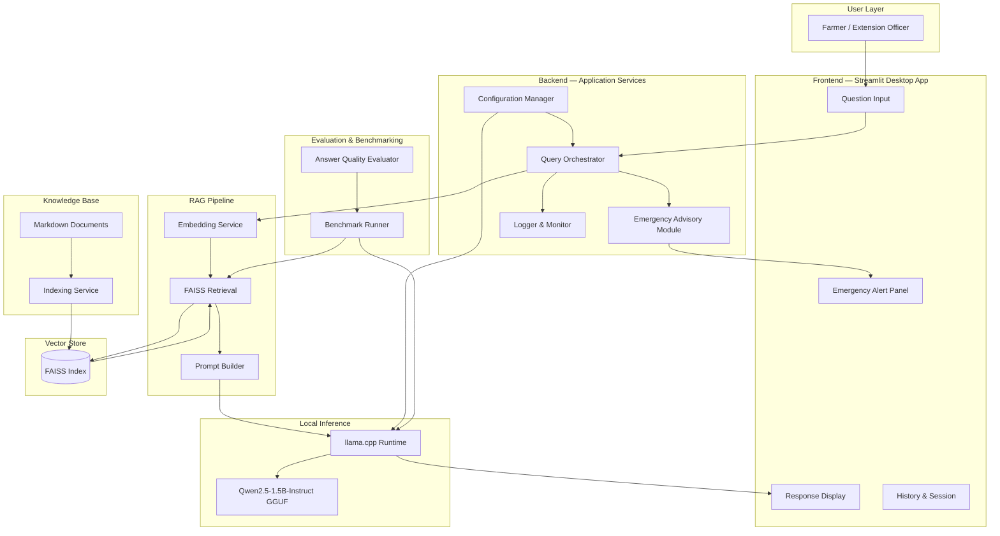

# System Overview

## Purpose

This document provides a high-level description of the PoultryGuard AI system: what it is, why it exists, who it serves, and how its major components relate to one another. It is the entry point for any engineer, reviewer, or contributor seeking to understand the system before reading more detailed design documents.

---

## Background

Poultry farming is a critical livelihood for millions of smallholder farmers across sub-Saharan Africa. Access to timely, accurate veterinary and agronomic guidance is severely limited in rural areas due to poor internet connectivity, shortage of extension officers, and high cost of professional consultations.

PoultryGuard AI addresses this gap by delivering an intelligent, offline-capable advisory assistant that runs entirely on modest consumer hardware. The system is designed for the Africa Deep Tech Challenge (ADTC) 2026 and must operate without cloud APIs, internet access, or dedicated GPU hardware.

---

## Design Decisions

| Decision | Rationale |
|---|---|
| Offline-first architecture | Rural areas have unreliable or no internet. All inference and retrieval must work without connectivity. |
| GGUF model via llama.cpp | Enables CPU-only inference with quantised models that fit within 8 GB RAM. |
| Retrieval-Augmented Generation | Grounds model responses in curated, domain-specific knowledge rather than relying on model parametric memory alone. |
| FAISS vector store | Lightweight, embeddable, no server required, fast approximate nearest-neighbour search on CPU. |
| Markdown knowledge base | Human-readable, version-controllable, easy to extend by domain experts without programming knowledge. |
| Streamlit desktop UI | Rapid development, Python-native, suitable for MVP; can be replaced with a richer framework in later sprints. |
| Rule-based emergency module | Deterministic, zero-latency triage for critical disease alerts that must not depend on LLM availability. |

---

## System Architecture

---

## Component Responsibilities

| Component | Responsibility |
|---|---|
| Streamlit Frontend | Render farmer-facing UI, capture queries, display responses and alerts |
| Query Orchestrator | Route queries through emergency check, RAG pipeline, and LLM inference |
| Emergency Advisory Module | Rule-based triage for high-priority disease symptoms; deterministic, no LLM dependency |
| Embedding Service | Convert text chunks to dense vectors using a local embedding model |
| FAISS Retrieval | Approximate nearest-neighbour search over the indexed knowledge base |
| Prompt Builder | Assemble system prompt, retrieved context, and user query into a structured LLM prompt |
| llama.cpp Runtime | CPU-only GGUF model inference via `llama-cpp-python` |
| Knowledge Base | Curated Markdown documents covering diseases, vaccination, climate, biosecurity, feeding, management, and market |
| Indexing Service | Parse, chunk, embed, and persist knowledge base documents into the FAISS index |
| Configuration Manager | Load and validate runtime configuration from environment and config files |
| Logger & Monitor | Structured logging of queries, latency, memory usage, and errors |
| Benchmark Runner | Measure startup time, inference latency, RAM usage, and retrieval quality |
| Answer Quality Evaluator | Score responses against reference answers for ADTC submission evidence |

---

## Key Constraints

- Maximum RAM: 8 GB total system RAM
- CPU-only: no GPU, no CUDA, no Metal
- Offline: no network calls at runtime
- OS targets: Ubuntu 22.04 LTS and Windows 10/11
- Python: 3.11
- Model: Qwen2.5-1.5B-Instruct Q4_K_M GGUF (~1 GB on disk)

---

## Trade-offs

| Trade-off | Accepted Cost | Benefit |
|---|---|---|
| Small 1.5B parameter model | Lower reasoning depth than larger models | Fits in 8 GB RAM with headroom for OS and RAG |
| Quantised Q4_K_M | Slight quality reduction vs FP16 | ~4× memory reduction, viable on CPU |
| FAISS flat index | No incremental updates without full rebuild | Zero server dependency, fast on small corpora |
| Streamlit UI | Limited UI customisation | Fast development, Python-native, offline-capable |
| Markdown knowledge base | Manual curation effort | Human-readable, version-controlled, no database required |

---

## Future Improvements

- Replace Streamlit with a packaged Electron or Tauri desktop application for better offline UX
- Add multilingual support (Hausa, Swahili, Yoruba, Amharic) for broader African farmer reach
- Introduce incremental FAISS index updates to avoid full rebuilds on knowledge base changes
- Explore larger GGUF models (3B–7B) as hardware targets improve
- Add voice input/output for low-literacy users

---

## References

- [ADTC 2026 Competition Brief](https://adtc.africa)
- [llama.cpp](https://github.com/ggerganov/llama.cpp)
- [Qwen2.5 Model Card](https://huggingface.co/Qwen/Qwen2.5-1.5B-Instruct)
- [FAISS](https://github.com/facebookresearch/faiss)
- [Streamlit](https://streamlit.io)
- See also: `software_architecture.md`, `data_flow.md`, `rag_design.md`, `model_selection.md`
