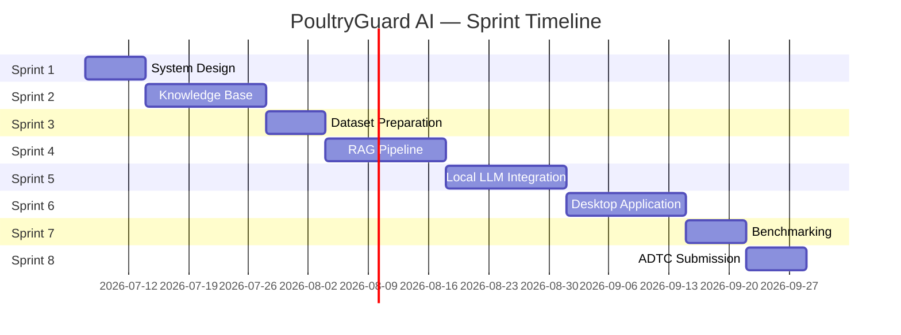

# Project Plan

## Overview

This document defines the PoultryGuard AI implementation roadmap for the Africa Deep Tech Challenge (ADTC) 2026. The project is organised into eight sprints, each with a clear objective, deliverables, acceptance criteria, and dependencies.

All sprints target the `feature/<sprint-name>` branch workflow. No sprint work is merged to `main` without passing CI (Ruff lint, Ruff format, pytest).

---

## Sprint Summary

| Sprint | Name | Focus | Branch |
|---|---|---|---|
| 1 | System Design | Architecture documentation | `feature/system-design` |
| 2 | Knowledge Base | Domain content curation | `feature/knowledge-base` |
| 3 | Dataset Preparation | Evaluation and training data | `feature/datasets` |
| 4 | RAG Pipeline | Chunking, embedding, retrieval | `feature/rag` |
| 5 | Local LLM Integration | llama.cpp inference | `feature/local-llm` |
| 6 | Desktop Application | Streamlit UI | `feature/frontend` |
| 7 | Benchmarking & Optimisation | Performance and quality | `feature/benchmarking` |
| 8 | ADTC Submission | Final packaging and submission | `feature/documentation` |

---

## Sprint 1 — System Design

**Objective:** Design the complete software architecture before implementing any application logic. Establish the technical foundation that all subsequent sprints build upon.

**Branch:** `feature/system-design`

**Deliverables:**

- [ ] `docs/architecture/system_overview.md`
- [ ] `docs/architecture/software_architecture.md`
- [ ] `docs/architecture/data_flow.md`
- [ ] `docs/architecture/model_selection.md`
- [ ] `docs/architecture/rag_design.md`
- [ ] `docs/architecture/deployment.md`
- [ ] `docs/architecture/adtc_alignment.md`
- [ ] `docs/project_plan.md`
- [ ] Updated `README.md`
- [ ] Updated `ROADMAP.md`
- [ ] Updated `CHANGELOG.md`

**Acceptance Criteria:**

- All architecture documents written to professional engineering standards
- Mermaid diagrams render correctly in GitHub Markdown
- Documents are internally consistent (no contradictions between files)
- ADTC alignment document maps every competition requirement to a design decision
- CI passes on the feature branch

**Dependencies:** None

---

## Sprint 2 — Knowledge Base

**Objective:** Curate a comprehensive, high-quality Markdown knowledge base covering all seven poultry farming domains. This is the primary data source for the RAG pipeline.

**Branch:** `feature/knowledge-base`

**Deliverables:**

- [ ] Markdown schema definition (`docs/knowledge_base_schema.md`)
- [ ] Minimum 5 documents per domain (35 documents total):
  - `knowledge_base/diseases/` — Newcastle, Avian Influenza, Gumboro, Marek's, Coccidiosis, Fowl Pox, Fowl Typhoid, Infectious Bronchitis
  - `knowledge_base/vaccination/` — Broiler schedule, Layer schedule, vaccine storage, administration guide
  - `knowledge_base/climate/` — Housing ventilation, heat stress, cold stress, humidity management
  - `knowledge_base/biosecurity/` — Farm biosecurity checklist, visitor protocols, disinfection guide
  - `knowledge_base/feeding/` — Broiler nutrition, layer nutrition, feed storage, water quality
  - `knowledge_base/management/` — Flock records, mortality tracking, production records
  - `knowledge_base/market/` — Market pricing, record keeping, cost management
- [ ] Source attribution for all documents
- [ ] Knowledge base quality review checklist
- [ ] `scripts/validate_knowledge_base.py` — validates schema compliance
- [ ] Updated `knowledge_base/README.md`

**Acceptance Criteria:**

- All documents follow the defined Markdown schema
- No documents contain invented facts (all claims sourced)
- `validate_knowledge_base.py` passes on all documents
- Minimum 35 documents across 7 domains
- CI passes

**Dependencies:** Sprint 1 (architecture defines KB schema)

---

## Sprint 3 — Dataset Preparation

**Objective:** Prepare evaluation datasets and synthetic question-answer pairs for benchmarking RAG retrieval quality and LLM answer quality.

**Branch:** `feature/datasets`

**Deliverables:**

- [ ] `datasets/raw/` — collected reference Q&A pairs from agricultural extension sources
- [ ] `datasets/processed/evaluation_set.json` — 100 question-answer pairs with domain labels
- [ ] `datasets/synthetic/synthetic_qa.json` — 200 synthetic Q&A pairs generated from KB documents
- [ ] `datasets/README.md` — dataset documentation and provenance
- [ ] `scripts/generate_synthetic_qa.py` — synthetic Q&A generation script
- [ ] `evaluation/metrics.py` — BLEU, ROUGE, and semantic similarity scoring
- [ ] `evaluation/README.md`

**Acceptance Criteria:**

- Evaluation set covers all 7 knowledge base domains
- Synthetic Q&A pairs are grounded in KB content (no hallucinated facts)
- Evaluation metrics script produces reproducible scores
- Dataset provenance documented
- CI passes

**Dependencies:** Sprint 2 (knowledge base required for synthetic Q&A generation)

---

## Sprint 4 — RAG Pipeline

**Objective:** Implement the complete RAG pipeline: document chunking, local embedding, FAISS indexing, retrieval, and prompt construction.

**Branch:** `feature/rag`

**Deliverables:**

- [ ] `rag/chunking/markdown_chunker.py`
- [ ] `rag/embeddings/embedder.py`
- [ ] `rag/indexing/index_builder.py`
- [ ] `rag/retrieval/retriever.py`
- [ ] `rag/prompts/prompt_builder.py`
- [ ] `scripts/build_index.py` — CLI script to build FAISS index
- [ ] `tests/unit/test_chunker.py`
- [ ] `tests/unit/test_embedder.py`
- [ ] `tests/unit/test_retriever.py`
- [ ] `tests/unit/test_prompt_builder.py`
- [ ] `tests/integration/test_rag_pipeline.py`
- [ ] Updated `requirements.txt` with `faiss-cpu`, `sentence-transformers`

**Acceptance Criteria:**

- `build_index.py` successfully indexes all KB documents
- Retriever returns relevant chunks for domain-specific queries (manual spot-check)
- Unit test coverage ≥ 80% for all RAG modules
- Integration test exercises full pipeline without LLM
- Retrieval latency < 500 ms on ADTC laptop spec
- CI passes

**Dependencies:** Sprint 2 (knowledge base), Sprint 3 (evaluation dataset for retrieval quality check)

---

## Sprint 5 — Local LLM Integration

**Objective:** Integrate llama.cpp inference via `llama-cpp-python`, implement the query orchestrator, emergency advisory module, and configuration management.

**Branch:** `feature/local-llm`

**Deliverables:**

- [ ] `models/inference/llm_runner.py`
- [ ] `models/configs/model_profiles.py`
- [ ] `app/backend/orchestrator.py`
- [ ] `app/services/query_service.py`
- [ ] `app/services/emergency_service.py`
- [ ] `app/services/session_service.py`
- [ ] `app/config/settings.py`
- [ ] `app/config/defaults.py`
- [ ] `app/utils/logger.py`
- [ ] `app/utils/timer.py`
- [ ] `app/utils/memory.py`
- [ ] `scripts/download_model.py`
- [ ] `tests/unit/test_emergency_service.py`
- [ ] `tests/unit/test_orchestrator.py`
- [ ] `tests/smoke/test_full_pipeline.py` (with mock LLM)
- [ ] Updated `requirements.txt` with `llama-cpp-python`

**Acceptance Criteria:**

- Full query pipeline executes end-to-end with real GGUF model
- Emergency module correctly identifies critical disease keywords
- RAM usage stays below 6 GB during inference
- Inference latency < 60 seconds on ADTC laptop spec
- All unit tests pass
- Smoke test passes with mock LLM (no model file required for CI)
- CI passes

**Dependencies:** Sprint 4 (RAG pipeline)

---

## Sprint 6 — Desktop Application

**Objective:** Build the Streamlit desktop UI with all farmer-facing workflows, session management, and the emergency alert panel.

**Branch:** `feature/frontend`

**Deliverables:**

- [ ] `app/frontend/pages/home.py`
- [ ] `app/frontend/pages/disease_advisor.py`
- [ ] `app/frontend/pages/vaccination.py`
- [ ] `app/frontend/pages/climate.py`
- [ ] `app/frontend/pages/biosecurity.py`
- [ ] `app/frontend/pages/feeding.py`
- [ ] `app/frontend/pages/records.py`
- [ ] `app/frontend/components/chat_widget.py`
- [ ] `app/frontend/components/alert_banner.py`
- [ ] `app/frontend/components/sidebar.py`
- [ ] `app/backend/main.py` — Streamlit entry point
- [ ] `demo/demo_walkthrough.md`
- [ ] `docs/screenshots/` — UI screenshots for ADTC submission
- [ ] Updated `requirements.txt` with `streamlit`

**Acceptance Criteria:**

- All 7 domain pages functional
- Emergency alert banner displays for critical queries
- Session history persists within a session
- UI is accessible (keyboard navigable, sufficient colour contrast)
- Application starts in < 30 seconds on ADTC laptop
- Manual end-to-end test passes for all domain workflows
- CI passes

**Dependencies:** Sprint 5 (backend services and LLM integration)

---

## Sprint 7 — Benchmarking and Optimisation

**Objective:** Measure system performance against ADTC targets, optimise bottlenecks, and produce reproducible benchmark evidence for the competition submission.

**Branch:** `feature/benchmarking`

**Deliverables:**

- [ ] `benchmarks/run_benchmarks.py` — full benchmark suite
- [ ] `benchmarks/results/benchmark_report.json`
- [ ] `profiler/profile_inference.py`
- [ ] `profiler/profile_retrieval.py`
- [ ] `evaluation/run_evaluation.py` — answer quality evaluation
- [ ] `evaluation/results/evaluation_report.json`
- [ ] `docs/benchmarks/benchmark_results.md`
- [ ] `docs/benchmarks/optimisation_log.md`

**Acceptance Criteria:**

- All ADTC performance targets met (see `adtc_alignment.md`)
- Startup time < 30 seconds
- Query latency < 30 seconds (subsequent queries)
- RAM usage < 6 GB peak
- Answer relevance score > 0.7
- Benchmark results reproducible across two runs
- CI passes

**Dependencies:** Sprint 6 (full application required for end-to-end benchmarking)

---

## Sprint 8 — ADTC Submission

**Objective:** Finalise all documentation, freeze versions, produce the competition submission package, and tag the release candidate.

**Branch:** `feature/documentation`

**Deliverables:**

- [ ] `report/adtc_submission_report.md` — competition report
- [ ] `report/technical_summary.md`
- [ ] `demo/demo_script.md` — judge demonstration script
- [ ] `docs/deployment/offline_setup_guide.md`
- [ ] `docs/api/api_reference.md`
- [ ] Final `README.md` with screenshots and demo GIF
- [ ] Final `CHANGELOG.md` with all sprint entries
- [ ] Final `ROADMAP.md` marked complete
- [ ] Git tag: `v1.0.0-adtc`
- [ ] GitHub Release with offline distribution package

**Acceptance Criteria:**

- All documentation complete and internally consistent
- `v1.0.0-adtc` tag created on `main`
- GitHub Release includes offline distribution package
- All CI checks pass on `main`
- ADTC submission checklist fully completed
- Demo runs successfully on ADTC Standard Laptop

**Dependencies:** Sprint 7 (benchmark results required for submission report)

---

## Milestone Timeline

---

## Definition of Done

A sprint is complete when:

1. All deliverables listed above are present in the repository
2. `ruff check .` passes with zero errors
3. `ruff format --check .` passes
4. `pytest` passes with zero failures
5. A pull request has been opened from the feature branch to `main`
6. The PR description includes: Summary, Files Changed, Reason for Changes, Testing Completed, Potential Improvements
7. `CHANGELOG.md` has been updated with the sprint's changes
8. `README.md` and `ROADMAP.md` reflect the current state

---

## References

- See `docs/architecture/` for all architecture documents
- See `ROADMAP.md` for the high-level phase overview
- See `CHANGELOG.md` for the change history
